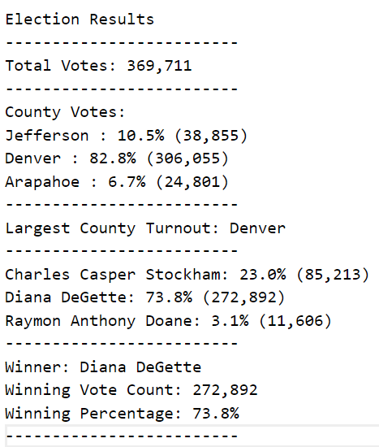

# Election Analysis

## Overview of Election Audit 
The Colorado Board of Elections has assigned the task to complete an election audit of a recent local congression election. The following steps were included to process the analysis:  
1. Calculate the total number of votes cast.
2. Get a complete list of candidates who received votes. 
3. Calculate the total number of votes each candidate received.
4. Calculate the percentage of votes each candidate won.
5. Determine the winner of the election based on popular vote.

## Resources
- Data Source: [election_results.csv](Resources/election_results.csv)
- Software: Python 3.10.3, Visual Studio Code 1.65.2

## Election-Audit Results
The following information has been gathered from conducting the analysis on the congressional election:

- There were 369,711 votes cast in the election.

- The voter turnout for each county was:

    - Jefferson produced 10.5% of voters, for a total of 38,855 voters.
    - Denver produced 82.8% of voters, for a total of 306,055 voters.
    - Arapahoe produced 6.7% of voters, for a total of 24,801 voters.

- The county with the largest voter turnout was:
    - Denver, which produced 82.8% of voters, for a total of 306,055 voters.

- The candidates were:

    - Charles Casper Stockham
    - Diana DeGette
    - Raymon Anthony Doane

- The candidate results were:

    - Charles Casper Stockham received 23.0% of the vote, for a total of 85,213 votes.
    - Diana DeGette received 73.8% of the vote, for a total of 272,892 votes.
    - Raymon Anthony Doane received 3.1% of the vote, for a total of 11,606 votes.

- The winner of the election was:
    - Diana DeGette, who received 73.8% of the vote for a total of 272,892 votes.

Please see below for a snapshot of the congressional election results. The text version of the election results summary can be found [here](Analysis/election_results.txt).

## Election-Audit Summary

In a summary statement, provide a business proposal to the election commission on how this script can be used—with some modifications—for any election. Give at least two examples of how this script can be modified to be used for other elections.

The election analysis included voter turnout by county with candidates results. Analysing the data by county and by candidate was a great addition, seeing as it provided a more detailed insight on the voters. The election script can also easily be modified to be used for any future election.  

Modifying the script can greatly benefit the Colorado Board of Elections and aid in the retrieval of data in future elections. The modification can be achieved by  
